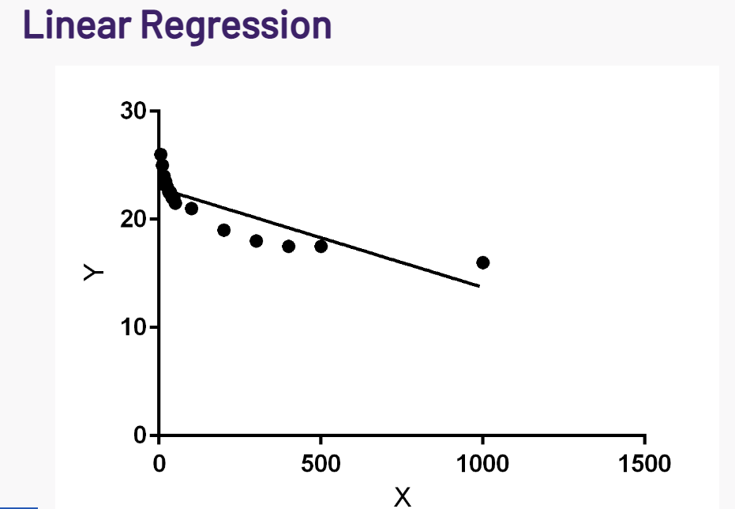

<!-- # TODO
- Motivate story - Interesting intro - blabla
- Once attention is grabbed, detail the research questions -->


<!-- # Introduction (Better title?) -->
## Doesn't everyone like beer?!
Beer is the world's most widely consumed alcoholic drink [2] and is the third-most consumed drink overall, after only water and tea. It is enormously popular - but not everybody likes beer, nor does everyone like the same type of beer!

 First have a look at means per state... Some preliminary geographical difference visible?

<!-- Map of states and their average rating -->
<iframe src="./Pages/States.html" title="States - Means" width="100%" height="800" frameBorder="0"></iframe>

How about per country?

<!-- Distribution of ratings per country -->
<iframe src="./Pages/ratings_countries_app.html" title="Countries - Distribution" width="100%" height="800" frameBorder="0"></iframe>

Report some numbers and significance ratios.. (Kasimir will do)

Some differences occur! Why?
Attempt to remove user bias by rescaling the ratings per user. (Kasimir will do) TODO: method for Countries-dist -> describe rescaling
Somewhat fails (again report numbers using a table!)
Maybe due to the beers rated by country/state? 
Next idea: look at most rated beers per state and country:

<!-- Top beers per state -->
<iframe src="./Pages/states_beer_app.html" title="Top beers per state" width="100%" height="800" frameBorder="0"></iframe>

<!-- Top beers per country -->
<iframe src="./Pages/boxplots_of_aspects_for_all_countries.html" title="Top beers per country" width="100%" height="800" frameBorder="0"></iframe>

Our data is skewed. Global average is not representative for the actual quality of beers.
Indeed, very different beers rated per country
Significant in global ratings for top beers versus countries/states (Kasimir will do) (Add a table!)

<!-- Matthieus part  -->

<!-- Oisin suggestion to have some random catchy titles to split up the story a bit -->
## We don't like no foreign beers!

If each country has its own way of enjoying beer, it is also interesting to see how they perceive foreign beverages. In particular, can we observe some consumer preferences towards local products as compared to foreign ones?

<!-- TODO -->
Following paragraph motivate matching, remove if extra:

To allow apple to apple comparison, the ideal controlled experiment would ask consummers to rate a set of beers, randomly changing the origin label to have a balance between local and foreign groups. To mimic this in an observational study, we instead match reviews between the two groups based on the beer quality and user's level of criticism (details are shown in the "method" tab of the next figure).

Once we match reviews by pair, we the ratings are different. Let's look at the results below:
<!-- Plot with distributions (Rating distribution per group - foreign vs local) -->

<iframe src="./Pages/home_bias.html" title="Distribution of local and foreign reviews" width="100%" height="1000" frameBorder="0"></iframe>

The difference of distribution of rating between local and foreign reviews is almost indistinguishable. Indeed, the users only seem to give on average (MEAN DIFF) points more to local beers compared to reviews. However, despite being small, the difference is still significant as shown by the small p-value (P VALUE).

<!-- Oisin suggestion to have some random catchy titles to split up the story a bit -->
## Does this hold per country also?

Since our dataset has a majority of reviews written by americans, the observation might not be representative of user in other countries. In the following plot, let's look at the home bias when grouping user by country for the top 10 countries on the website to investigate if there are more information hidden under the hood.

<!-- Plot with confidence intervals  -->

<iframe src="./Pages/home_bias_countries.html" title="Distribution of local and foreign reviews" width="100%" height="800" frameBorder="0"></iframe>

Interestingly, there now seem to be a majority of countries showing negative home bias, meaning that user would actually rate higher foreign beers compared to local beers. This contradiction is a manifestation of Simpson's paradox: when users are combined, the majoritarian country (US) masks the effect of all others. 

<!-- TODO: add citation -->
Let's also note that Belgium, which is quite renowned for its beer [3], seem to still prefer their local beers.

<!-- Should we write references as [1] or nah? -->
These results are interesting but it is hard to find a good foolproof explanation behind each user's behaviour. Indeed, favoritism towards local or foreign brands has been extensively studied in social sciences. For example, Balabanis _et al._ [4] summarise the possible explanations to five effects, which will either bias the consumer toward choosing local brands or, conversely, toward foreign ones. Given our lack of data on consumer profile, it is not possible to further quantify each effect. Our analysis can therefore only yield the composition of all effects.

<!-- Oisins part -->
<!-- Motivate look at language:
Is this bias reflected in language?
Foreign vs local beers (Oisin will do) [give numbers]
-> Move to more general language analysis
Do countries talk differently? -->

## Do people also talk about foreign vs local beer differently?

Clearly, a difference exists between foreign and local beers in terms of their ratings. But does this also manifest itself in the language used in these beer reviews?

Firstly, we need to tackle a simpler question: how can we even quantify whether or not people talk differently?

To do this, we leverage state-of-the-art machine learning methods which have been specifically developed for textual analyses like this (word2vec [5], GloVe [6] and FastTest [7, 8]). Using these methods, this allows us to find how close two texts are - which is precisely what we need!
Also, we use an ensemble model, meaning we can even track how much variation we have in our predictions.

Applying this to foreign versus local beer, we can find that there is a difference of μ ± σ = 0.38 ± 0.17. This agrees with the previous result i.e. people do treat foreign and local beers differently, but it is very uncertain.

_How about if we just look at the US?_
Could it be that the non-Americans sound more American when talking about American beer rather than their local beers? The answer surprisingly is no! In fact, reviews by non-Americans of American beers are _even further away_ (18.5% further) from reviews of Americans than reviews of non-Americans of their own local beers.

Why is this? First of all, our results are quite uncertain - meaning that we cannot rule out the opposite trend. _BUT,_ the current trend can nonetheless be explained:

- It may be that users which review foreign beers constitute an entirely different social class to other users. Although the website itself attracts a very specific type of person, it is obvious that within this there are also wildly differing demographics. For example, perhaps it may be that users who review foreign beers are richer and travel more, constituting an upper class. Via education differences etc., this class likely also have a different means of talking as compared to the general populations. Thus, this may be a possible explanation.
- There may be a psychological effect. When talking about foreign beers, it may that users exaggerate their own speaking mannerisms in order to distinguish themselves. For some, their language can be a mark of pride. As an example, the English are unlikely to ever use the word "soccer" in any case, but they may make a point of explicitly using or exaggerating the word "football" when the conversation is about American culture/people/things.

## Why are we only looking at foreign vs local reviews? Don't people also talk about beer differently too?

Language and culture are interlinked, so we know different cultures have different ways of expressing their preferences for beers. Let's look at an example!

<!-- the beer wordcloud  -->
<iframe src="./Pages/wordcloud.html" title="Wordcloud" width="100%" height="1000" frameBorder="0"></iframe>

A canonical example of differences between English usage among countries is American versus British English. Even at a cursory glance, we can already see the spelling differences occurring - American spellings of "color" and "flavor" versus British spellings of "colour" and "flavour".

However, we also see some cultural difference arising too!

There is also more prominence in the American wordcloud for positive words - we can see "great", "good", "really", "nice", "much", "good", "well", "nice" all occuring very often whereas in the English wordcloud these occur less frequently. This is a known difference between British and American culture - the British are known for having a "stiff upper lip" and Americans are known for being very optimistic and upbeat (e.g. see [9] and [10]).

## So, countries talk differently. Can we cluster countries based on how similarly they talk?

<!-- Some differences, can we cluster countries or states based on language? -->

Since countries talk differently, we can use the differences in the way they talk to cluster them together. With this approach, do we find that geographically similar countries also talk similarly?

<!-- dendrogram across countries -->
<iframe src="./Pages/dendrogram.html" title="Dendrogram" width="100%" height="800" frameBorder="0"></iframe>

We can see that in general, geographic proximity does not entirely determine how similarly countries talk. This does make sense, since geographic proximity also does not determine how similarly two people sound either. For example, it is known that the United Kingdom has the largest variation of accents of any country in the world [11, 12]. In fact, we see exactly this effect, with the UK nations not being particularly close. On the other hand, Canada and the United States are very similar as anticipated.

## How about for states?

We can conduct the same analysis for US states to find the linguistic similarity between them. We plot these on a 2D grid, with a marker size equal to sqrt(#reviews).

<!-- network of states  -->
<iframe src="./Pages/network.html" title="Network" width="100%" height="800" frameBorder="0"></iframe>

We can also see again that geographic proximity does not entirely predict linguistic similarity. Nonetheless, we do see some clusters of states that occur. For example, Pennsylvania and New York are extremely close in both the RateBeer and BeerAdvocate datasets.

We also note that states with more reviews are quite similar, with most of the outliers being states with few reviews - for example, South Dakota is an outlier in both datasets due to having very few reviews. We do note that peripheral states such as Hawaii are less linguistically similar to others, but in general states are similar. This points to the fact that America is relatively homogeneous in general in its language usage.

[ELABORATE]

<!-- Final parts and takeaways -->
<!-- Key bullet points and takeaways (Table) -->
# So, what insights have we learned?
- Countries rate differently (a lot of it is due to user bias)
- Countries rate different beers (they have different quality)
- Propensity matching (Matthieu: is there more to say?) 
- Countries talk differently about beer
- Cultural difference is not entirely geographical (network)

# Where can I find out more?
Our code is publicly available [here](https://github.com/epfl-ada/ada-2022-project-enchiladas), and detailed explanations of the methods employed can be found in the notebooks. We have also included a summarised methods tab for each of figure to explain our approach.

# References

[1] "Psychology and culture", Annual Review of Psychology, [Lehman, D. R., Chiu, C. Y., & Schaller, M. (2004)](https://www2.psych.ubc.ca/~schaller/LehmanChiuSchaller2004.pdf)

[2] "European Beer Statistics", European Beer Guide, [Pattinson, R. (2005)](http://www.europeanbeerguide.net/eustats.htm#production)

[3] "The 13 Best Beer Countries in the World, Ranked", Thrillist, [Mack, Z. (2015)](https://www.thrillist.com/drink/nation/the-best-beer-countries-in-the-world)

[4] "Favoritism Toward Foreign and Domestic Brands: A Comparison of Different Theoretical Explanations", Journal of International Marketing, [Balabanis, G., Stathopoulou, A., & Qiao, J. (2019)](https://openaccess.city.ac.uk/id/eprint/23521/)

[5] "Efficient estimation of word representations in vector space", Arxiv, [Mikolov, T., Chen, K., Corrado, G. and Dean, J. (2013)](https://arxiv.org/abs/1301.3781)

[6] "GloVe: Global Vectors for Word Representation", Proceedings of the 2014 Conference on Empirical Methods in Natural Language Processing, [Pennington, J., Socher, R. and Manning, C.D. (2014)](https://nlp.stanford.edu/pubs/glove.pdf)

[7] "Enriching Word Vectors with Subword Information", Transactions of the Association for Computational Linguistics , [Bojanowski, P., Grave, E., Joulin, A. and Mikolov, T. (2017)](https://arxiv.org/abs/1607.04606v1)

[8] "Bag of Tricks for Efficient Text Classification", Arxiv, [Joulin, A., Grave, E., Bojanowski, P. and Mikolov, T. (2016)](https://arxiv.org/abs/1607.01759)

[9] "Brits DO have a stiff upper lip: Americans more optimistic and romantic than Britons", MailOnline, [Bond, A. (2013)](https://www.dailymail.co.uk/news/article-2346351/Brits-DO-stiff-upper-lip-Americans-optimistic-romantic-Britons.html)

[10] "What Makes Americans So Optimistic?", The Atlantic, [Keller, J. (2015)](https://www.theatlantic.com/politics/archive/2015/03/the-american-ethic-and-the-spirit-of-optimism/388538/)

[11] "Why are there so many regional accents in the UK, in comparison to other English-speaking countries?", The Guardian, [Various Contributors](https://www.theguardian.com/notesandqueries/query/0,5753,-18336,00.html#:~:text=SEMANTIC%20ENIGMAS-,Why%20are%20there%20so%20many%20regional%20accents%20in%20the%20UK,to%20other%20English%2Dspeaking%20countries%3F&text=Until%20the%201930s%20communication%20between,means%20of%20retaining%20an%20identity)

[12] "Accents in Britain", AccentBiasBritain, [Unknown](https://accentbiasbritain.org/accents-in-britain/)


Text can be **bold**, _italic_, or ~~strikethrough~~.

[Link to another page](./another-page.html).

```{python}
print("Hello Python!")
```

<iframe src="./pages/bignumber.html" title="Tutorials" width="100%" height="350" frameBorder="0"></iframe>

There should be whitespace between paragraphs.


There should be whitespace between paragraphs. We recommend including a README, or a file with information about your project.

# Header 1

This is a normal paragraph following a header. GitHub is a code hosting platform for version control and collaboration. It lets you and others work together on projects from anywhere.


<iframe src="./pages/new_rep.html" title="Tutorials" width="100%" height="800" frameBorder="0"></iframe>


## Header 2

> This is a blockquote following a header.
>
> When something is important enough, you do it even if the odds are not in your favor.

### Header 3

```js
// Javascript code with syntax highlighting.
var fun = function lang(l) {
  dateformat.i18n = require('./lang/' + l)
  return true;
}
```

```ruby
# Ruby code with syntax highlighting
GitHubPages::Dependencies.gems.each do |gem, version|
  s.add_dependency(gem, "= #{version}")
end
```

#### Header 4

*   This is an unordered list following a header.
*   This is an unordered list following a header.
*   This is an unordered list following a header.


##### Header 5

1.  This is an ordered list following a header.
2.  This is an ordered list following a header.
3.  This is an ordered list following a header.




###### Header 6

| head1        | head two          | three |
|:-------------|:------------------|:------|
| ok           | good swedish fish | nice  |
| out of stock | good and plenty   | nice  |
| ok           | good `oreos`      | hmm   |
| ok           | good `zoute` drop | yumm  |

### There's a horizontal rule below this.

* * *

### Here is an unordered list:

*   Item foo
*   Item bar
*   Item baz
*   Item zip

### And an ordered list:

1.  Item one
1.  Item two
1.  Item three
1.  Item four

### And a nested list:

- level 1 item
  - level 2 item
  - level 2 item
    - level 3 item
    - level 3 item
- level 1 item
  - level 2 item
  - level 2 item
  - level 2 item
- level 1 item
  - level 2 item
  - level 2 item
- level 1 item

### Small image


### Large image


### Definition lists can be used with HTML syntax.

<dl>
<dt>Name</dt>
<dd>Godzilla</dd>
<dt>Born</dt>
<dd>1952</dd>
<dt>Birthplace</dt>
<dd>Japan</dd>
<dt>Color</dt>
<dd>Green</dd>
</dl>

```
Long, single-line code blocks should not wrap. They should horizontally scroll if they are too long. This line should be long enough to demonstrate this.
```

```
The final element.
```